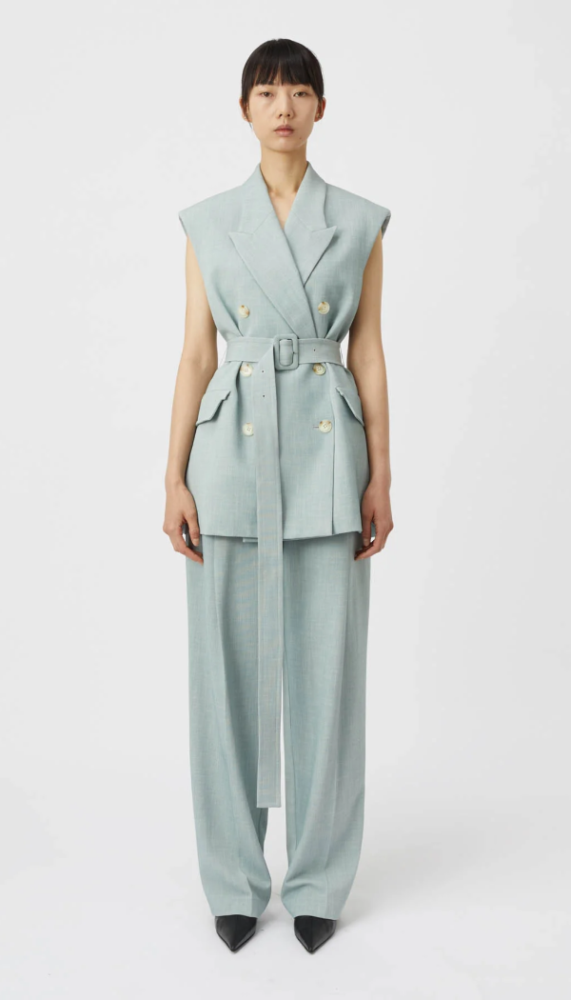
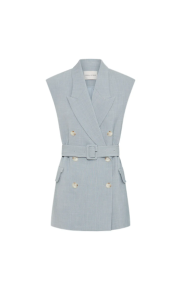
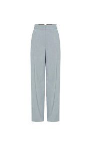
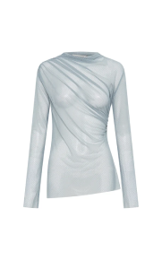

# Email Template - CAMILLA AND MARC

This email-teplate contains an elegant and responsive email template designed for promotional purposes. The template is suitable for fashion brands or businesses showcasing collections, products, and new arrivals.

https://github.com/user-attachments/assets/3aff22da-df86-4692-b20c-f4d22591f081

## Features

- **Responsive Design**
- **Elegant Styling**
- **Interactive Buttons**
- **Footer with Quick Links**

 ----

### Responsive Design

1. Mobile-first, adaptive to various screen sizes.
2. Optimized layout for both mobile and desktop devices.


### Elegant Styling

1. Clean typography using custom fonts like  `Saol Display`, `Inter`.
2. A tonal palette that complements sophisticated brand aesthetics.

### Interactive Buttons

1. Includes hover effects for better user engagement.

### Grid Layout for Products

1. Displays featured products in an intuitive grid format.


### Footer with Quick Links

1. Easily navigable links for exploring collections, social media, and more.

--- 

# Code Snippets

## Hero Section

The header section introduces the brand name and showcases the hero image.


```html
<h1 class="title-h1">CAMILLA AND MARC</h1>

```

## Product Grid

Displays a collection of products in a responsive grid layout.


```html
<div class="grid">
  <div class="grid-item">
    <a href="https://example.com/product-1" target="_blank">
      
    </a>
  </div>
  <div class="grid-item">
    <a href="https://example.com/product-2" target="_blank">
      
    </a>
  </div>
  <div class="grid-item">
    <a href="https://example.com/product-3" target="_blank">
      
    </a>
  </div>
</div>
```

## Interactive Buttons

Interactive call-to-action buttons for better engagement.

```html
<a href="https://example.com/new-arrivals" target="_blank">
  <button>NEW ARRIVALS</button>
</a>
```

## Footer

Provides navigation links and brand information.


```html
<footer>
  <h1>
    <a href="https://www.camillaandmarc.com/" target="_blank">CAMILLAANDMARC.COM</a>
  </h1>
  <p>2024 CAMILLA AND MARC AU</p>
  <p>287 Young Street Sydney, NSW 2017</p>
  <a href="https://www.camillaandmarc.com/" target="_blank">Unsubscribe</a>
</footer>
```

# Folder Structure

```arduino
├── assets/
│   ├── image1.png
│   ├── grid1.png
│   ├── grid2.png
│   ├── grid3.png
│   ├── grid4.png
│   ├── grid5.png
│   └── grid6.png
├── email-template.html
├── README.md
└── preview/
    ├── desktop-preview.png
    ├── mobile-preview.png
    └── template-animation.gif
```


This version includes all necessary information and code snippets for your Quick and faster email template development, presented in a clear and organized manner.
